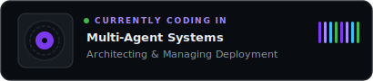

<div align="center">

<!-- Animated Header Banner -->


<!-- Typing SVG -->
<a href="https://git.io/typing-svg">
  
</a>

<!-- Animated Social Icons -->
<p>
  <a href="https://www.linkedin.com/in/avneet-pandey-1365b8184">
    
  </a>&nbsp;
  <a href="https://avneet-pandey.azurewebsites.net/">
    
  </a>&nbsp;
  <a href="mailto:avneetpandey82@gmail.com">
    
  </a>&nbsp;
  <a href="tel:6472713487">
    
  </a>
</p>

<!-- Animated Line -->


<br/>

<!-- Profile Badges -->
<p>
  <a href="https://www.linkedin.com/in/avneet-pandey-1365b8184"></a>
  <a href="https://avneet-pandey.azurewebsites.net/"></a>
  <a href="mailto:avneetpandey82@gmail.com"></a>
  <a href="tel:6472713487"></a>
  
</p>

<!-- Open to Work & Certs -->
<p>
  
  &nbsp;
  
  &nbsp;
  
</p>

<!-- GitHub Trophies -->
<p>
  <a href="https://github.com/ryo-ma/github-profile-trophy">
    
  </a>
</p>

<!-- Live AI Orchestration Dashboard -->
<p>
  
</p>

</div>

---

## 🧠 About Me

```typescript
class Engineer {
  readonly name = "Avneet Pandey";
  readonly role = "Full Stack & GenAI Engineer";
  readonly location = "Toronto, ON 🍁";
  readonly contact = {
    email: "avneetpandey82@gmail.com",
    phone: "+1 (647) 271-3487"
  };

  readonly languages = ["TypeScript", "Python", "JavaScript", "Go", "SQL"];
  readonly specializations = {
    frontend: ["React", "Next.js", "Vite", "Tailwind", "Framer Motion"],
    backend: ["FastAPI", "Node.js", "NestJS", "GraphQL"],
    ai: ["LangChain", "LangGraph", "CrewAI", "RAG (with Guardrails)", "MCP Servers", "Langfuse"],
    cloud: ["Azure (AZ-204)", "AWS", "Docker", "Kubernetes", "Terraform"],
    databases: ["PostgreSQL", "MongoDB", "Redis", "Pinecone", "Weaviate"],
  };

  readonly currentFocus =
    "Building agentic AI systems & multi-agent orchestration";
  readonly funFact = "I debug production at 3 AM with a smile ☕";
}
```

> 💡 Building **production-grade** full-stack apps and **GenAI systems** that scale.
> From RAG pipelines to multi-agent orchestration — I turn complex AI ideas into **real products**.

<div align="center">
  
</div>

## ⚡ What I'm Working On Right Now

<!-- This section makes your profile feel "alive" — senior devs show current focus -->

* 🔭 **Building**: Multi-agent SaaS platform with LangGraph + MCP servers
* 🌱 **Learning**: Advanced prompt engineering & fine-tuning LLMs | **Architecting best RAG pipelines with guardrails (utilizing <mark>Langfuse</mark> for observability ⚡)**
* 👯 **Open to**: Collaborating on GenAI / agentic AI open source projects
* 🎯 **2026 Goal**: Launch 2 AI-powered SaaS products & contribute to LangChain core
* 💬 **Ask me**: React architecture, RAG pipelines, agentic AI patterns
* 📫 **Reach me**: avneetpandey82@gmail.com | (647) 271-3487

<div align="center">
  
</div>

## 🛠️ Tech Stack

<!-- Using skillicons.dev — these render as beautiful, recognizable logos that look way more polished than shields.io badges -->

<div align="center">

**Languages**


**Frontend**


**Backend**


**AI / LLM & Agents**


**Databases & Storage**


&nbsp;

<img src="https://img.shields.io/badge/Weaviate-9B5DE5?style=for-the-badge&logo=data:image/svg%2Bxml;base64,PHN2ZyB4bWxucz0iaHR0cDovL3d3dy53My5vcmcvMjAwMC9zdmciIHhtbG5zOnhsaW5rPSJodHRwOi8vd3d3LnczLm9yZy8xOTk5L3hsaW5rIiB3aWR0aD0iMTA0IiBoZWlnaHQ9IjczIiB2aWV3Qm94PSIwIDAgMTA0IDczIj48ZGVmcz48cGF0aCBpZD0iYSIgZD0iTTQuMzEgMThMLjYxMSAxLjcxNmgzLjA2Mkw2LjAxIDEyLjEwMyA4LjkzNiAxLjcxNmgyLjU4NWwyLjk0OSAxMC4zODcgMi4zMTMtMTAuMzg3aDMuMDYyTDE2LjE3MSAxOEgxMy4yTDEwLjE4MyA3LjQ3NiA3LjI1OCAxOHoiLz48cGF0aCBpZD0iYiIgZD0iTTI5LjU1NCAxNC40NjJsMi41NCAxLjIwMmMtMS4yOTMgMS44MzctMi45OTQgMi42NTQtNS41MzQgMi42NTQtMy44MzMgMC02LjMwNS0yLjgxMy02LjMwNS02LjM1IDAtMy4yOSAyLjM4Mi02LjMyOSA2LjI2LTYuMzI5IDMuODEgMCA2LjM5NiAyLjcyMiA2LjM5NiA2LjUzMiAwIC4yNzItLjAyMy40MDgtLjAyMi42OGgtOS43MDdjLjI5NSAxLjc5MiAxLjY1NSAyLjc5IDMuMzggMi43OSAxLjI5MiAwIDIuMTU0LS4zNjMgMi45OTMtMS4xOHptLTYuMjM3LTMuOTkyaDYuNTU0Yy0uNDA4LTIuMjY4LTMuMzEtMi4yNjgtMS40OTggMC0yLjY1NC43NDktMy4yNDQgMi4yNjh6eiIvPjxsaW5lYXJHcmFkaWVudCBpZD0iYyIgeDE9Ii0uMDQzJSIgeDI9IjEwMC4xNTclIiB5MT0iNDkuOTg4JSIgeTI9Ijk5Ljk4OCUiPjxzdG9wIG9mZnNldD0iMCUiIHN0b3AtY29sb3I9IiMzNjRBNjgiLz48c3RvcCBvZmZzZXQ9IjEwMCUiIHN0b3AtY29sb3I9IiMzOEQ2MTEiLz48L2xpbmVhckdyYWRpZW50PjwvZGVmcz48ZyBmaWxsPSJub25lIiBmaWxsLXJ1bGU9Im5vbnplcm8iPjxnIHRyYW5zZm9ybT0idHJhbnNsYXRlKC40NSA1My4xNykiPjx1c2UgZmlsbD0iIzAwMCIgeGxpbms6aHJlZj0iI2EiLz48dXNlIGZpbGw9IiMyRTM1MzYiIHhsaW5rOmhyZWY9IiNhIi8+PC9nPjxnIHRyYW5zZm9ybT0idHJhbnNsYXRlKC40NSA1My4xNykiPjx1c2UgZmlsbD0iIzAwMCIgeGxpbms6aHJlZj0iI2IiLz48dXNlIGZpbGw9IiMyRTM1MzYiIHhsaW5rOmhyZWY9IiNiIi8+PC9nPjxwYXRoIGZpbGw9IiMzOEQ2MTEiIGQ9Ik01MyAxMy4xMmwtLjg3LS41LjI1LS40My44Ny41LS4yNS40M3ptLTIuMzYuMjRsLS4yNS0uNDMuODYtLjUuMjUuNDMtLjg2LjV6bTQuMDkuNzZsLS4genericLS41LjI1LS40My44Ny41LS4yNS40M3ptLTUuODIuMjRsLS4yNS0uNDMuODYtLjUuMjUuNDMtLjg2LjV6bTcuNTUuNjZsLS4gODctLjUuMjUtLjQzLjg3LjUtLjI1LjQzem0tOS4yNy4yNS0uMTktLjQ0Ljg3LS41LjI1LjQzLS45My5Uxem0xMSAuNzZsLS44Ny0uNS4yNi0uNDQuODcuNTEtLjI2LjQzem0tMTIuNzcuMjRsLS4yNS0uNDMuODctLjUuMjUuNDMtLjg3LjV6bTE0LjQzLjc2bC0uOTYtLjUuMjUtLjQzLjg2LjUtLjI1LjQzem0tMTYuMjMuMjRsLS4yLS40My44Ny0uNS4yNS40My0uOTIuNXptMTggLjc2bC0uODctLjUuMjUtLjQzLjg3LjUtLjI1LjQzem0tMTkuNy4yNGwtLjI1LS40My44Ni0uNS4yNS40My0uODYuNXptMjEuNDQuNzZsLS44OC0uNS4yNS0uNDMuODguNS0uMjUuNDN6bS0yMy4xOC4yNGwtLjE4LS40My44Ni0uNS4yNS40My0uOTMuNXptMjQuOTEuNzZsLS44Ny0uNS4yNy0uNDMuODcuNS0uMjctLjQzem0tMjYuNjUuMjRsLS4yNS0uNDMuODctLjUuMjUuNDMtLjg3LjV6bTI4LjQuNzZsLS44NC0uNTEuMjUtLjQzLjg2LjUtLjI3LjQ0em0tMzAuMTEuMjRMMzMgMjNoLjg2LS41LjI1LjQzLS44NS40NXptMzguNzkuNzZsLS44Ny0uNS4zMy0uNDMuODcuNS0uMzMuNDN6bS00MC41My4yNGwtLS4yNC0uMzguODctLjUuMjUuNDMtLjg4LjQ1em00Mi4yNi43NmwtLjg3LS41LjI1LS40My44OC41LS4yNi40M3ptLTQ0IC4yNGwtLjI0LS4zOC44OC0uNS4yNS40My0uODkuNDV6bTQ1Ljc0Ljc2bC0uODYtLjUuMjUtLjQzLjg2LjUtLjI1LjQzem0tNDcuMzYuMjVsLS4yNC0uMzkuODctLjUuMjUuNDMtLjg4LjQ2em00OS4yLjc2bC0uODYtLjUuMjUtLjQ0Ljc3LjUxLS4xNi40M3ptLTUwLjkzLjI0bC0uMjQtLjM5Ljg2LS41LjI1LjQzLS44Ny40NnptNTIuNjcuNzZsLS44Ny0uNS4yNS0uNDMuODcuNS0uMjUuNDN6bS01NC40LjI0bC0uMjUtLjM5Ljg3LS41LjI1LjQzLS44Ny40NnptNTYuMS43NmwtLjg3LS41LjI1LS40My44Ny41LS4yNS40M3ptLTU3Ljg5LjI0bC0uMjQtLjM5Ljg3LS41LjI1LjQzLS44OC40NnptNTkuNjIuNzZsLS44Ni0uNS4yNS0uNDMuODYuNS0uMjUuNDN6bS02MS40MS4yNGwtLjI0LS4zOS44Ny0uNS4yNS40My0uODguNDZ6bTYzLjExLjc2bC0uODYtLjUuMjUtLjQzLjg2LjUtLjI1LjQzem0tNjQuODEuMjRsLS4yNC0uMzkuODctLjUuMjUuNDMtLjg4LjQ2em0tMS4zMy43N2wtLjI1LS40My40NC0uMjcuMjUuNDQtLjQ0LjI2em02Ny44OCBzbC0uODctLjUxLjI1LS40My44Ny41MS0uMjUuNDN6Ii8%2BPHBhdGggZmlsbD0iIzM4RDYxMSIgZD0iTTE5LjQ4IDMyLjE5aC0xdi0uNDZoMXYuNDZ6bTIgMGgtMXYtLjQ2aDF2LjQ2em0yIDBoLTF2LS40Nmgxdi40NnptMiAwaC0xdi0uNDZoMXYuNDZ6bTIgMGgtMXYtLjQ2aDF2LjQ2em0yIDBoLTF2LS40Nmgxdi40NnptMiAwaC0xdi0uNDZoMXYuNDZ6bTIgMGgtMXYtLjQ2aDF2LjQ2em0yIDBoLTF2LS40Nmgxdi40NnptMiAwaC0xdi0uNDZoMXYuNDZ6bTIgMGgtMXYtLjQ2aDF2LjQ2em0yIDBoLTF2LS40Nmgxdi40NnptMiAwaC0xdi0uNDZoMXYuNDZ6bTIgMGgtMXYtLjQ2aDF2LjQ2em0yIDBoLTF2LS40Nmgxdi40NnptMiAwaC0xdi0uNDZoMXYuNDZ6bTIgMGgtMXYtLjQ2aDF2LjQ2em0yIDBoLTF2LS40Nmgxdi40NnptMiAwaC0xdi0uNDZoMXYuNDZ6bTIgMGgtMXYtLjQ2aDF2LjQ2em0yIDBoLTF2LS40Nmgxdi40NnptMiAwaC0xdi0uNDZoMXYuNDZ6bTIgMGgtMXYtLjQ2aDF2LjQ2em0yIDBoLTF2LS40Nmgxdi40NnptMiAwaC0xdi0uNDZoMXYuNDZ6bTIgMGgtMXYtLjQ2aDF2LjQ2em0yIDBoLTF2LS40Nmgxdi40NnptMiAwaC0xdi0uNDZoMXYuNDZ6bTIgMGgtMXYtLjQ2aDF2LjQ2em0yIDBoLTF2LS40Nmgxdi40NnptMiAwaC0xdi0uNDZoMXYuNDZ6bTIgMGgtMXYtLjQ2aDF2LjQ2em0yIDBoLTF2LS40Nmgxdi40NnptMiAwaC0xdi0uNDZoMXYuNDZ6Ii8%2BPHBhdGggZmlsbD0idXJsKCNjKSIgZD0iTTY4LjA4LjY3djE5LjcxbC0xNi05LjI2TDM2IDIwLjM4Vi42N2wtMTkgMTF2MjAuODVsMTggMTAuNDIgMTctOS44NCAxNyA5Ljg0IDE4LTEwLjQyVjExLjY5TDY4LjA4LjY3ek0xOSAzMS4zN1YxMi44NWwxNS04LjY3VjQwbC0xNS04LjYzek02OC4wOCA0MGwtMTYtOS4yNUwzNiA0MFYyMi42OGwxNi05LjI0IDE2IDkuMjUuMDggMTcuMzF6bTE3LTguNjdsLTE1IDguNjdWNC4xOGwxNSA4LjY3djE4LjQ4eiIvPjwvZz48L3N2Zz4=" alt="Weaviate" />

**DevOps & Cloud**


**Testing & Tools**


</div>

<div align="center">
  
</div>

## 💼 Experience

<table>
<tr>
<td width="50%">

### 🟣 Full-Stack & GenAI Solution Engineer

**Freelancer (US Client)** · Toronto, ON  
`Jan 2026 – Present`

- Architected SaaS features with **React, TypeScript, Vite, FastAPI**
- Built agentic workflows via **LangChain, CrewAI & MCP** for knowledge search
- RAG pipelines with **Pinecone/Weaviate** for semantic retrieval
- Containerized services via **Docker** from dev to staging

</td>
<td width="50%">

### 🔵 Full-Stack Software Engineer

**MortgEdge** · Toronto, ON  
`Sep – Dec 2025`

- Enterprise **React + TypeScript** UI under strict design systems
- **90% faster** loan eligibility checks via **OpenAI API**
- Secure **Azure** financial pipelines with PIPEDA compliance
- Performance via `useMemo`, `useCallback`, code-splitting

</td>
</tr>
<tr>
<td width="50%">

### 🟢 Associate Software Developer

**Valuecoders** · Gurgaon, India  
`Feb 2021 – Mar 2024`

- **35% traffic boost** via **Next.js SSR** re-architecture
- **40% faster** document retrieval: **LangChain + Pinecone**
- **50+ code reviews** · Standardized **Redux Toolkit** across teams
- Integrated **Stripe, Google, Facebook APIs** at 99.9% reliability

</td>
<td width="50%">

### 🎓 Education & Certification

📜 **AZ-204** — Azure Developer Associate  
&nbsp;&nbsp;&nbsp;&nbsp;_Microsoft · July 2025_

🎓 **PG Diploma** — Cloud Computing  
&nbsp;&nbsp;&nbsp;&nbsp;_Loyalist College · 2024–2025_

🎓 **B.Tech** — Computer Science  
&nbsp;&nbsp;&nbsp;&nbsp;_Dronacharya College · 2017–2021_

</td>
</tr>
</table>

<div align="center">
  
</div>

## 🏆 Featured Projects

<div align="center">

| Project                    | Description                                                                                                              | Stack                                                 | Metric         |
| -------------------------- | ------------------------------------------------------------------------------------------------------------------------ | ----------------------------------------------------- | -------------- |
| 🫀 **Cancer-Copilot**      | Agentic AI health platform. LangGraph patient intake + RAG medical query engine — 30% accuracy boost over keyword search | `Next.js` `LangGraph` `Pinecone` `Redis` `Docker`     | ⚡ 92% faster  |
| 🏦 **MortgEdge Analytics** | Financial compliance suite with multi-scenario amortization calculators + real-time rate scraping via Playwright         | `Next.js` `PostgreSQL` `Python` `Playwright` `Stripe` | ⚡ 90% faster  |
| 🤖 **Smart Helpers**       | Multi-agent orchestration with custom MCP servers. Generative UI auto-renders WCAG-accessible HTML from live chat        | `Next.js` `MCP` `RAG` `Framer Motion`                 | 🧠 Multi-agent |
| 📋 **Inspection Center**   | Cross-platform PWA for field inspections. AI generates PDF reports; offline-first via service workers                    | `React` `PWA` `Node.js` `ChatGPT`                     | ⚡ 50% faster  |

</div>

<div align="center">
  
</div>

## 📊 GitHub Stats

<div align="center">

<p align="center">

  
</p>

<p align="center">
  
</p>

</div>

<div align="center">
  
</div>

## 📈 Contribution Graph

<div align="center">

<!-- Snake Game Animation -->
<picture>
  <source media="(prefers-color-scheme: dark)" srcset="https://raw.githubusercontent.com/avpansmw-2005/avpansmw-2005/output/github-contribution-grid-snake-dark.svg">
  <source media="(prefers-color-scheme: light)" srcset="https://raw.githubusercontent.com/avpansmw-2005/avpansmw-2005/output/github-contribution-grid-snake.svg">
  
</picture>

<br/>

<!-- Activity Graph -->
[](https://github.com/ashutosh00710/github-readme-activity-graph)

</div>

## 💡 Random Dev Quote

<div align="center">

[](https://github.com/piyushsuthar/github-readme-quotes)

</div>

<div align="center">
  
</div>

<div align="center">

<!-- Live Coding Soundtrack Visualizer -->
<p align="center">
  
</p>

<!-- Footer Wave -->


**💬 Let's build something great together!**

[](https://www.linkedin.com/in/avneet-pandey-1365b8184/)
[](https://avneet-pandey.azurewebsites.net/)
[](mailto:avneetpandey82@gmail.com)
[](tel:6472713487)

</div>
